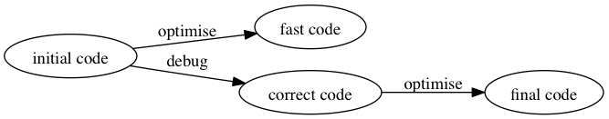
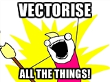

## Slow R is slow

R is slow because

- it's flexible: things can be redefined dynamically
- it passes arguments by value
- the bottlenecks in hardware have changed since R started. 
- R Core don't have the resources to do optimisations that break lots of  things.

---

## Speeding up R code

**Syllabus**

- Timing and profiling
- Memory allocation
- Matrices and lists vs data frames
- Slow functions to watch out for
- Vectorisation (and memory tradeoffs)
- Embarassingly Parallel-isation
- The right tools: databases, netCDF, sparse matrices

**Epilogue**

Randomness: SSVD, subsampling

---

## Old White Guys

> *We should forget about small efficiencies, say about 97% of the time: premature optimization is the root of all evil. Yet we should not pass up our opportunities in that critical 3%.* (Knuth)

> *Life is short, the craft long; opportunity fleeting, experiment perilous, judgement difficult* (Hippocrates of Kos)

> *R has changed quite a lot recently, and older preconceptions do need to be checked against current information.* (Brian D. Ripley)


---

## Strategy




---

## Timing and profiling

*Measure* your code to find out what needs to be optimised -- if anything.

**Tools**: `Rprof`, `Rprofmem`, `tracemem`, `profvis`, `microbenchmark`

### Note: the compiler

In recent R versions, the Just-In-Time compiler defaults to 'on' and code gets faster as you run it. 

- `compiler:::enableJIT(0)` to turn it off
- or run a few times before timing. 

---

## Rprof() and profvis

A time-sampling profiler: takes notes on the state of R every so often (50ms default)

- Stack trace
- Optionally, current memory usage and number of vector duplications

`profvis` is a package for displaying `Rprof()` output better

---

## Rprofmem()

A memory-allocation profiler: writes a stack trace at every

- allocation of a 'large' object (>128bytes *[sic]*)
- allocation of a page on the R heap

Most useful if you need to trace allocations of a particular **size** (eg columns of your data)

---

## tracemem()

Marks an object so that a message is printed when the object is duplicated.

Useful for a single big object where duplications hurt.

---

## microbenchmark()

High-resolution timing for small bits of code

- useful for learning about principles
- typically not relevant for optimising real code


---

## "Growing" objects

Dumb example

```
> system.time({
+ 	x<-integer(0)
+ 	for(i in 1:1e5) 
+ 		x<-c(x,i^2)
+ })
   user  system elapsed 
 19.601   4.804  24.644 
```

---

## Preallocating

Dumb example

```
> system.time({
+ 	x<-integer(1e5)
+ 	for(i in 1:1e5) 
+ 		x[i]<-i^2
+ })
   user  system elapsed 
  0.047   0.011   0.058 
```

### (Vectorising)

```
> microbenchmark(x<-(1:1e5)^2)
Unit: microseconds
             expr     min      lq     mean  median      uq      max neval
 x <- (1:1e+05)^2 268.401 325.831 1037.601 416.456 769.639 36868.98   100
```

---

## Real example

- Computing accurate $p$-values for DNA-sequence association tests
- need  $\sum_i \lambda_i \chi^2_1$ distributions
- algorithm using symbolic operations on a basis of gamma functions [Bausch, 	arXiv:1208.2691]

---

## Old (90% of time in "c")

```
  for(i in 1:length(x@power)){
         for(j in 1:length(y@power)){
             if (x@exp[i]==y@exp[j]) {cat("#");next}
             term<-convone(x@exp[i],x@power[i],y@exp[j],y@power[j])
*             allcoef<-c(allcoef,term@coef*x@coef[i]*y@coef[j])
*             allpower<-c(allpower,term@power)
*             allexp<-c(allexp,term@exp)
         }
     }
     
     new("gammaconv", coef=allcoef,power=allpower,exp=allexp)
```

---

## New

```
    for(i in 1:length(x@power)){
        for(j in 1:length(y@power)){
            term<-convone(x@exp[i],x@power[i],y@exp[j],y@power[j])
*            size<-nrow(term)
            if(here+size>maxterms) stop("thomas can't count")
*            allcoef[here+(1:size)]<-term@coef*x@coef[i]*y@coef[j]
*            allpower[here+(1:size)]<-term@power
*            allexp[here+(1:size)]<-term@exp
*            here<-here+size
        }
    }
    
    new("gammaconv", coef=allcoef[1:here],power=allpower[1:here],
      exp=allexp[1:here])
```

Or preallocate a list, put short vectors in as elements, use `do.call(c, the_list)` at the end

---

## Memory copying

- "Pass by value illusion": R behaves as if functions get **copies** of their arguments
- Actually not copied unless modified
- *Sometimes* not copied, if R *knows* it doesn't need to.
    - .Primitive operations 
    - on local variables 
    - that have never been passed to a function

---

R doesn't know `x` is safe

```
> system.time({
*+ 	touch<-function(z) {force(z); NULL}
+ 	x<-integer(1e5)
+ 	y<-integer(1e5)
+ 	for(i in 1:1e5){ 
*+ 		touch(x)
+ 		x[i]<-i^2
+ 		}
+ })
   user  system elapsed 
 36.195  10.854  47.061 
```

---

R does know `x` is safe

```
> system.time({
*+ 	touch<-function(z) {force(z); NULL}
+ 	x<-integer(1e5)
+ 	y<-integer(1e5)
+ 	for(i in 1:1e5){ 
*+ 		touch(y)
+ 		x[i]<-i^2
+ 		}
+ })
   user  system elapsed 
  0.166   0.025   0.190 
```

---

## Dataframes are slower

```
> dim(acsdf)
[1] 151885    298
> microbenchmark(sum(acsdf[,100]))
Unit: microseconds
              expr   min     lq     mean median    uq    max neval
 sum(acsdf[, 100]) 7.654 8.6315 11.29369  9.117 9.784 75.909   100
> microbenchmark(sum(acslist[[100]]))
Unit: nanoseconds
                expr min    lq   mean median    uq   max neval
 sum(acslist[[100]]) 330 340.5 740.67    447 561.5 10817   100
```

---

## Dataframes are slower


```
> str(sequence)
 num [1:5000, 1:4028] 0 0 0 0 0 0 0 0 0 0 ...
> system.time(colMeans(sequence))
   user  system elapsed 
  0.026   0.000   0.026 
> system.time(colMeans(sequencedf))
   user  system elapsed 
  0.186   0.059   0.246 
> microbenchmark(sequence[200:250,200:250])
Unit: microseconds
                       expr
 sequence[200:250, 200:250]
              min     lq     mean  median      uq    max neval
              8.938 9.4135 11.76206 10.0835 10.4745 34.582   100
> microbenchmark(sequencedf[200:250,200:250])
Unit: microseconds
                         expr     
 sequencedf[200:250, 200:250] 
             min      lq     mean  median       uq      max neval
             437.748 484.339 1565.898 567.917 666.1715 95096.32   100
  
```
---

## Other alternatives

`data.table` and `tbl` are both faster. 

They both claim to be drop-in replacements for `data.frame`. 

Neither actually is, but they're *close*, and if you're editing the code anyway...


---

## Matrices: BLAS

The *Basic Linear Algebra Subsystem* has the elementary matrix and vector operations in standardised form

- Matrix operations in R are already in efficient C
- Data flow onto the CPU is main bottleneck
- Using an optimised version of BLAS can still help **a lot**
    - Apple vecLib,  Intel MKL, OpenBLAS
- Don't write your own linear algebra, let the professionals do it.    

---

### Reference BLAS

```
x<-matrix(rnorm(1000*2000),ncol=1000)
> system.time(m<-crossprod(x))
   user  system elapsed 
  1.040   0.002   1.043 
> system.time(solve(m))
   user  system elapsed 
  1.116   0.008   1.131 
```

### Apple vecLib BLAS

```
> x<-matrix(rnorm(1000*2000),ncol=1000)
> system.time(m<-crossprod(x))
   user  system elapsed 
  0.399   0.007   0.112 
> system.time(solve(m))
   user  system elapsed 
  0.244   0.014   0.105 
```

---

## Slow functions

`ifelse()`, `pmax()`, `pmin()`

Why? Flexibility (eg, what is the output type?)

Instead of 

```
x <- ifelse(y, a, b)
```

try

```
x<-a
x[y]<-b[y]
```

---

### Example

```
x<-1:1000
z<-1000:1

microbenchmark(ifelse(x+z>1000,x,z))
microbenchmark({i<-(x+z>1000); y<-x;y[i]<-z[i]})

x<-rnorm(10000)
microbenchmark(pmax(0,pmin(x,1)))
microbenchmark(
{i<-x>1
x[i]<-1
i<-x<0
x[i]<-0}
)
```

---

## Slow functions

`lm`, `glm` are user-friendly wrappers for `lm.fit`, `lm.wfit`, `glm.fit`

Can be worth constructing the design matrix yourself if

- it's big
- there are a lot of them and they're simple
- you know enough linear algebra to use the functions

For **very** large cases, try the `biglm` package.

---

## NA, NaN, Inf

```
> x<-matrix(rnorm(1e7),ncol=1e3)
> system.time(cor(x))
   user  system elapsed 
  6.255   0.022   6.281 
> system.time(crossprod(scale(x)))
   user  system elapsed 
  1.377   0.195   1.049 
```

With no allowance for missing data these would be the same computation.

R can't assume complete data. **You** may be able to.


---

## Vectorisation

Try to use vector and matrix operations in R's internals, even if it's theoretically inefficient



---

### Convolution

$$z_i=\sum_{j+k=i}x_iy_i$$

If $x_i=\Pr(X=i)$ and $y_j=\Pr(Y=j)$, then $z_i=\Pr(X+Y=i)$

```
conv1<-function(x,y){
m <- length(x)
n <- length(y)
z <- numeric(m+n-1)
for(j in 1:m){
	for (k in 1:n){
		z[j+k-1] <- z[j+k-1] + x[j]*y[k]
		}
	}
	z
}	
```


---


## Partly vectorised	
	
```
conv2<-function(x,y){
m <- length(x)
n <- length(y)
z <- numeric(m+n-1)
for(j in 1:m){
		z[j+(1:n)-1] <- z[j+(1:n)-1] + x[j]*y[(1:n)]
	}
	z
}
```


---

### Fully vectorised

```
conv3<-function(x,y){
  m <- length(x)
  n <- length(y)

  xy<-outer(x,y,"*")
  xyshift<-matrix(rbind(xy,matrix(0,n,n))[1:((m+n-1)*n)],ncol=n)
  rowSums(xyshift)
}
```


---

### Timings

```
> system.time(conv1(x,y))
   user  system elapsed 
 19.440   0.159  19.585 
> system.time(conv2(x,y))
   user  system elapsed 
  0.533   0.116   0.650 
> system.time(conv3(x,y))
   user  system elapsed 
  0.876   0.051   0.891 
> compiler::enableJIT(3)
[1] 0
*> system.time(conv1(x,y))
*   user  system elapsed 
*  1.722   0.065   1.795 
> system.time(conv2(x,y))
   user  system elapsed 
  0.518   0.164   0.684 
> system.time(conv3(x,y))
   user  system elapsed 
  0.848   0.051   0.863 
```

Your mileage may vary: try it

---

### Example: power calculation

Power for detecting a 2mmHg blood pressure change with standard deviation 7mmHg

```
system.time({
my.sims <- replicate(10000, {
    mydiff <- rnorm(100, 2, 7)
    t.test(mydiff)$p.value
})
})
```

**How do we speed it up?**

### talk to your neighbour

---


## Example: genetic permutation test 

10 genetic variants (SNPs) in a gene

Regress blood pressure on each one (adjusted for age, sex)

Is largest $Z$-statistic interestingly large? For genome-wide values of interesting?

---

 ### Simple code

```
one.snp = function(snp, perm, df){
    coef(summary(lm(sbp~as.numeric(snp)[perm]+sex,data=df)))[2,3]
}

one.gene<-function(snps, perm, df){
    p<-ncol(snps)
    zs<-sapply(1:p, function(i) one.snp(snps[,i], perm, df))
    max(abs(zs))
}

one.perm<-function(snps, df){
    n<-nrow(snps)
    one.gene(snps,perm=sample(1:n), df)
}

many.perm <- replicate(1000, one.perm(snps,  phenotype))

real.max.Z <- one.gene(snps,1:nrow(snps),phenotype)
mean(many.perm < real.max.Z)
```

---

## Where will it be slow?

### (talk to your neighbour)


---

## Parallel

Relatively unusual in stats for explicit parallel processing to be *faster* than just running lots of copies of R (can be simpler)

- if parallel section is short, explicit parallelisation may be less expensive (lower average load)
- **shared memory** may allow more R processes to fit in memory

---

```
x<-matrix(rnorm(1e8),ncol=4)
y<-rnorm(nrow(x))
> system.time(mclapply(1:4, function(i) { cor(x[,i],y)},mc.cores=4))
   user  system elapsed 
  3.024   1.192   1.142 
> system.time(lapply(1:4, function(i) { cor(x[,i],y)}))
   user  system elapsed 
  1.797   0.272   2.077 
```

Common tradeoff: more CPU-seconds used, less elapsed time.

---

## Variations

Redoing setup work

```
> system.time(mclapply(1:4, 
+   function(i) {
+      set.seed(1) 
+      x<-matrix(rnorm(1e8),ncol=4)
+      y<-rnorm(nrow(x))
+      cor(x[,i],y)
+      },mc.cores=4))

   user  system elapsed 
 34.158   7.689  32.162 
``` 

---

Forcing memory duplication

```
x<-matrix(rnorm(1e8),ncol=4)
y<-rnorm(nrow(x))
> system.time(mclapply(1:4, 
   function(i) {x[1]<-x[1]
      cor(x[,i],y)
    },mc.cores=4))
   user  system elapsed 
  3.100   2.138   4.843 
```

---


## Data storage

- large data frames in database tables
- large arrays in netCDF or similar
- large sparse matrices in sparse formats


---

### Database storage

The American Community Survey five-year person file

- 16GB of CSVs
- over 8 million records
- won't fit in R on laptop

Use MonetDB for simple database analyses, behind `dbplyr`

(Data reading took 5-10 minutes)

---

## Example

```
library(MonetDBLite)
library(dplyr)
library(dbplyr)

ms <- MonetDBLite::src_monetdblite("~/acs")
acstbl<-tbl(ms, "acs")
acstbl %>% summarise(count(agep))
acstbl %>% group_by(st) %>% summarise(avg(agep))

acstbl %>% group_by(st) %>% summarise(sum(pwgtp*agep*1.0)/sum(pwgtp))
```

MonetDB is optimised for this sort of computation on a single computer: advantageous when data size ~ 1/3 physical memory

---

## Sparse matrices

In some applications, there are large matrices with mostly zero entries. 

The zeroes don't need to be stored: this can help a lot with memory use and matrix multiplication speed.  

Support in the `Matrix` package

Example: (simulated) human DNA sequence data: 5000 people, 4028 variants

---

```
> load("AKLfaster/sequence.rda")
> str(sequence)
 num [1:5000, 1:4028] 0 0 0 0 0 0 0 0 0 0 ...
> library(Matrix)
> M<-Matrix(sequence)
> str(M)
Formal class 'dgCMatrix' [package "Matrix"] with 6 slots
  ..@ i       : int [1:287350] 713 4006 12 20 37 41 67 80 102 103 ...
  ..@ p       : int [1:4029] 0 2 468 934 935 937 1032 1034 1035 1037 ...
  ..@ Dim     : int [1:2] 5000 4028
  ..@ Dimnames:List of 2
  .. ..$ : NULL
  .. ..$ : NULL
  ..@ x       : num [1:287350] 1 1 1 1 1 1 1 1 1 1 ...
  ..@ factors : list()
> object.size(M)
3465736 bytes
> object.size(sequence)
161120200 bytes
> system.time(crossprod(M))
   user  system elapsed 
  0.207   0.028   0.238 
> system.time(crossprod(sequence))
   user  system elapsed 
  5.493   0.052   1.614 
```

---

### "Matrix-free" operations

Many uses of matrices (iterative solvers, eigenthingies) don't need the individual elements, just the ability to compute $y\mapsto My$.

Fast for

- Sparse matrices
- Projections

Trivial: $n$ vs $n^2$ operations
```
y-mean(y)
```

Less trivial: $np^2+p^3$ vs $n^2$ operations


```
qr.resid(qr(X),y)
```


---

```
> x<-rnorm(5000)
> system.time({
+ P<-matrix(-1/5000,ncol=5000,nrow=5000)
+ diag(P)<-diag(P)+1
+ P%*%x
+ })
   user  system elapsed 
  0.473   0.185   0.646 

> microbenchmark(x-mean(x))
Unit: microseconds
        expr    min      lq     mean  median     uq    max neval
 x - mean(x) 18.663 19.2265 19.80241 19.4575 19.747 46.837   100
> microbenchmark(x-sum(x)/5000)
Unit: microseconds
            expr    min      lq     mean  median      uq    max neval
 x - sum(x)/5000 10.792 20.1035 24.52196 25.0765 28.9615 41.306   100
```
---


## Conway's "Life"


Cellular automaton:

- grid of cells,'alive' or 'dead'
- cells with 0,1,5,6 neighbours 'die'
- empty cells with 3 neighbour 'born'

**Look at `life-basic.R` and think about optimisation.**

### talk to your neighbour


---

## Epilogue: random algorithms

Statisticians should know that sampling works

- Sampling from a database
   - including stratified sampling, case-control sampling
- random projections for nearest neighbours
- Stochastic SVD

---

## Stochastic SVD

- Principal components on an $n\times m$ matrix takes $nm^2$ time
- Statisticians usually want $k\ll m$ dimensions
- Take random $k+p$ dimensional projection $\Omega$
    - compute $A\Omega$
    - project $A$ on to the subspace spanned by $A\Omega$
    - SVD the projection
- Gives almost the same leading $k$ singular vectors, for small $p$.
- Takes only $nm(k+p)$ time

**Only** accurate if $m$, $n$ large, $k+p$ at least moderate

---

### Example 

```  
load("sequence.rda")
# devtools::install_github("tslumley/bigQF")
library(bigQF)

system.time(s1<-svd(sequence,nu=10,nv=10))
system.time(s2<-ssvd(sequence, n=10,U=TRUE,V=TRUE))
spseq<-sparse.matrixfree(Matrix(sequence))
system.time(s3<-ssvd(spseq, n=10,U=TRUE,V=TRUE))

plot(s1$u[,1:2],pch=19)
points(s2$u[,1:2],col="red")

plot(s1$u[,1:2],pch=19)
points(s3$v[,1],-s3$v[,2],col="green")
```    

---


# Simple Rule: There are no simple rules

### Measure twice; debug once

### Vectorise

### Experiment

### Keep up with modern tools

